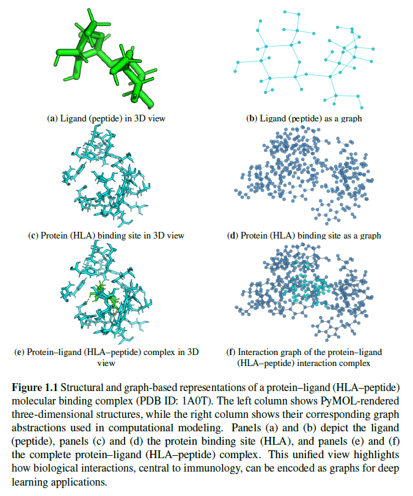

# Towards Graph Modelling and Graph-based Deep Learning for Computational Immunology: A Focus on the Innate Immune Response

This repository contains an implementation summary and reproducible code for my PhD thesis, which was submitted in partial fulfilment of the requirements for the degree of **Doctor of Philosophy** at **Atlantic Technological University (ATU), Donegal, Ireland**.

**Author:** Mallikharjuna Rao Sakhamuri  
<!-- **Supervisors:** Dr. Shagufta Henna, Dr. Leo Creedon, Dr. Kevin Meehan  -->
**Submission:** December 2025

## Overview

This repository accompanies my doctoral research on graph modelling and graph-based deep learning for computational immunology, with a focus on the innate immune response. The work develops and evaluates multiple graph learning contributions including robust graph modelling, interaction-aware learning, self-supervised representation learning, explainability-based bias analysis, and bias-resilient capsule network architectures.

  
   
  <em>
    Structural and graph-based representations of an HLA–peptide complex. The figure contrasts 3D structural views with their graph abstractions: the peptide (a, b), the HLA binding site (c, d), and the complete HLA–peptide complex (e, f). In the graph representations, atoms are encoded as nodes and biochemical or spatial interactions are encoded as edges, illustrating how binding interactions can be translated into graph form for computational modelling.
  </em>

## Abstract

  
<strong>Click to expand</strong>

Understanding how the human immune system detects and responds to foreign molecules is fundamental to vaccine design and immunotherapy. These responses are governed by complex molecular interactions, where the structural arrangement of molecules and the pattern of their interactions determine the resulting immune response. Graph-based deep learning, particularly graph neural networks (GNNs), has emerged as a prominent approach because it represents molecular structure as a graph, with atoms or residues as nodes and their interactions as edges, preserving structural and relational information and learning by passing information along these edges. Yet applying GNNs effectively in immunology remains constrained by persistent challenges. GNN performance can be unstable when biological interaction graph data are noisy or incomplete, and large graphs are computationally demanding. Many GNN formulations also underuse interaction information. In addition, labelled datasets are limited, restricting supervised training, while synthetic data generation can expand datasets but may introduce bias. Biases can also arise from real-world data and architectural assumptions, which can distort prediction outcomes.

This thesis advances GNN-based modeling for immunology through a set of contributions that improve reliability, interaction sensitivity, data efficiency, and interpretability. It proposes an iterative GNN framework that progressively refines graph representations to keep learning stable under noisy and incomplete biological interaction data. It further introduces edge-centric GNN modeling that treats molecular interactions as a primary learning signal, enabling predictions to reflect interaction strength and character. To reduce reliance on scarce labelled datasets, it develops a self-supervised GNN approach that learns transferable molecular representations from unlabeled graph data. It also uses explainability methods for GNNs to identify and explain model biases, improving transparency. Finally, it introduces a capsule-based GNN architecture designed to be resilient to bias and to better preserve rare but important interaction patterns in immune-related prediction.

Keywords: Computational immunology, Graph neural networks, Peptide–HLA binding, Self-supervised learning, Generative modeling, Bias and robustness.

---

## Repository Structure

The repository is organised by thesis chapter. Each chapter has corresponding subfolders under `Code/`, `Images/`, and `DataSets/`.

### Top-level folders

- `Code/`  
  Source code and runnable experiments grouped by chapter and contribution.

- `Images/`  
  Figures, plots, and visual artefacts grouped by chapter for reporting and documentation.

- `DataSets/`  
  Input datasets, preprocessed artefacts, and experiment outputs grouped by chapter. Some large artefacts may be excluded depending on GitHub size constraints and `.gitignore` rules.

## Chapter Mapping and Contributions

Following the introduction, the thesis is organised into chapters that develop, analyse, and evaluate the proposed graph-based methods for HLA-peptide modelling.

### Chapter 2: Graph-based Models for HLA-Peptide Interactions in Innate Immunity
This chapter presents graph-based models for HLA-peptide interactions. It describes residue-level physicochemical graph construction and introduces adaptive graph learning mechanisms to produce stable, informative graph structures under noisy and heterogeneous biological data.

- `Code/GraphImmuno/`
- `Images/GraphImmuno/`
- `DataSets/GraphImmuno/`

### Chapter 3: Interaction-aware Representation Learning with Edge-centric and Dual Hypergraph Formulations
This chapter focuses on modelling interactions as first-class signals. It develops edge-centric learning and dual hypergraph formulations to represent interactions explicitly and to capture higher-order residue relations for immune recognition tasks.

- `Code/Hypergraph_DHT/`
- `Images/Hypergraph_DHT/`
- `DataSets/Hypergraph_DHT/`

### Chapter 4: Self-supervised Pretraining and Generative Graph Modelling for Molecular Graphs
This chapter presents a self-supervised learning framework for molecular graphs together with generative graph models. It examines how unlabeled and synthetic HLA-peptide graphs can be used to pretrain GNNs and improve downstream performance when labelled data are limited.

- `Code/GMACORE-TM/`
- `Images/GMACORE-TM/`
- `DataSets/GMACORE-TM/`

### Chapter 5: Explainability and Bias Analysis for Predictive and Generative GNNs
This chapter introduces an explainability framework for both predictive and generative GNNs in immunological modelling. It analyses how data sources and model components influence predictions, and it quantifies biases arising from synthetic augmentation and dataset imbalance.

- `Code/XAI/`
- `Images/XAI/`
- Uses shared datasets from `DataSets/GMACORE-TM/`

### Chapter 6: Bias-tolerant GNN Architectures with Capsule-inspired Designs
This chapter proposes bias-tolerant graph neural network architectures based on capsule-inspired designs. It introduces methods that preserve substructure information and regularise the representation space to reduce structural, dataset-induced, and architectural biases, improving robustness across diverse HLA-peptide settings.

- `Code/ImmuDeCaps/`
- `Images/ImmuDeCaps/`
- `DataSets/ImmuDeCaps/`

---

## Notes on Data Management

- If a dataset or generated artefact is too large for GitHub, it may be excluded through `.gitignore`.
- Where applicable, keep lightweight metadata, scripts, and reproducibility instructions in the repository, and store very large artefacts externally.

---

## Contact

For questions about the repository or reproducibility, please contact:

Mallikharjuna Rao Sakhamuri  
Email: L00157129@atu.ie
